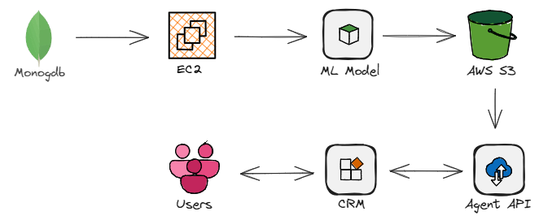
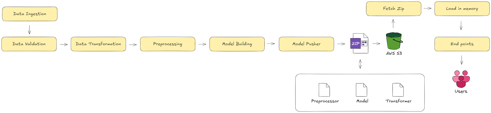
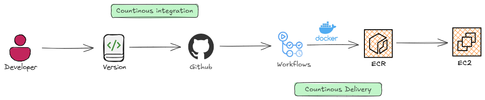
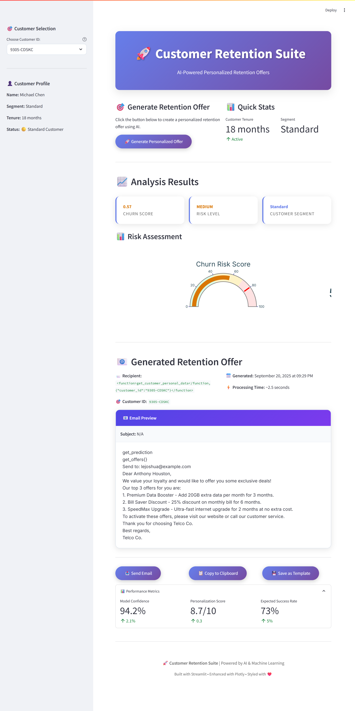

# ChurnX: AI-Powered Telco Customer Retention
We build an ML-powered churn prediction system for a telecom company that not only identifies at-risk customers and key churn drivers but also uses Agno AI Agent and Rasa Chatbot to deliver personalized offers, automate retention conversations, and boost customer loyalty.

**Use case**: Customer support rep enters customer ID in CRM → backend calls agent API → suggests best retention offer


## Why Churn Matters

* Acquiring new customers costs 5–25x more than keeping existing ones.
* A 5% boost in retention can raise profits by 25–95%.
* High churn signals deeper issues in product, service, or customer experience.

▶️ **[Watch the Project Demo on YouTube](https://youtu.be/-Qweg6sH1fY)**

## ChurnX Architecture

> ML pipeline trains in EC2 and pushes the latest model to S3. The agent microservice pulls that model and exposes it as an API. Any company system (web, CRM, apps) can call the agent API to get predictions + recommended sales offers. This makes the ML system usable by business teams in real-time, not just a research model.

## ETL Pipeline


## Agent Architecture


## ML Architecture

## ML Deployment Architecture



## Installation Guide
Follow these steps to set up and run the project on your system

### 1. Clone the Repository
```
https://github.com/lintosunny/churn-x.git
```

### 2. Create a virtual environment & install dependencies
```
uv sync
```

### 3. Activate the Virtual Environment
windows
```
.venv\Scripts\activate
```

Linux/Max
```
source .venv/bin/activate
```

### 4. Set up Environment Variables
Create a ```.env``` file in the project root and add the following:

```
# ---------------------------------
# MongoDB
# ---------------------------------
MONGO_DB_URL=
MONGO_DB = 
MONGO_COLLECTION = 

# ---------------------------------
# MLFLOW
# ---------------------------------
MLFLOW_TRACKING_URI=
MLFLOW_TRACKING_USERNAME=
MLFLOW_TRACKING_PASSWORD=

# ---------------------------------
# PostgresSQL
# ---------------------------------
PG_USER = 
PG_PASSWORD = 
PG_HOST = 
PG_PORT = 
PG_NAME = 

# ---------------------------------
# LLM
# ---------------------------------
GROQ_API_KEY = 

# ---------------------------------
# AWS
# ---------------------------------
AWS_BUCKET_NAME = 
AWS_ACCESS_KEY_ID = 
AWS_SECRET_ACCESS_KEY = 
AWS_DEFAULT_REGION = 
```

### 5. Setup PostgreSQL
*[Download PostgreSQL](https://www.postgresql.org/download/)*  ->  Create ```telcodb``` database

```
python -m telcoDB.seed_db
```

### 6. Run Agent API
```
uvicorn agent.api.service:app --reload
```

### 7. Run Streamlit APP
```
streamlit run app.py
```

# How to deploy ml in ec2
- download aws cli


## Streamlit APP
