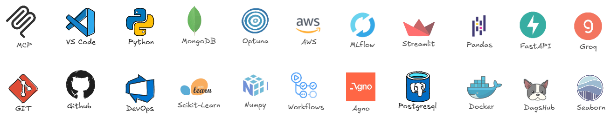
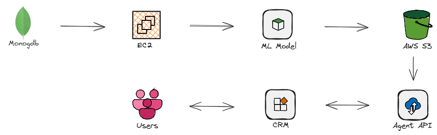
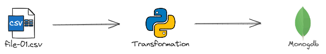
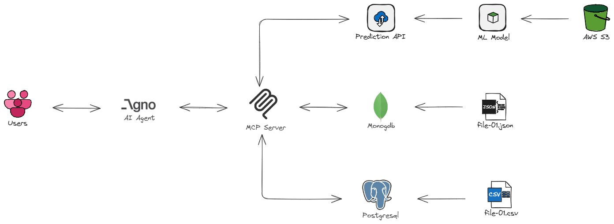
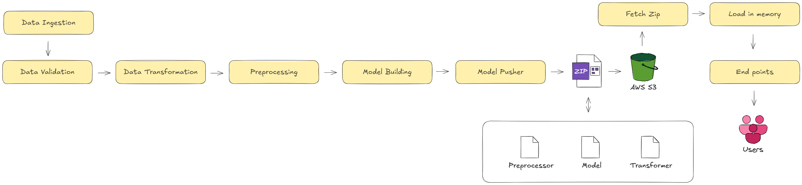
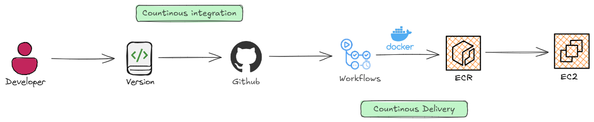
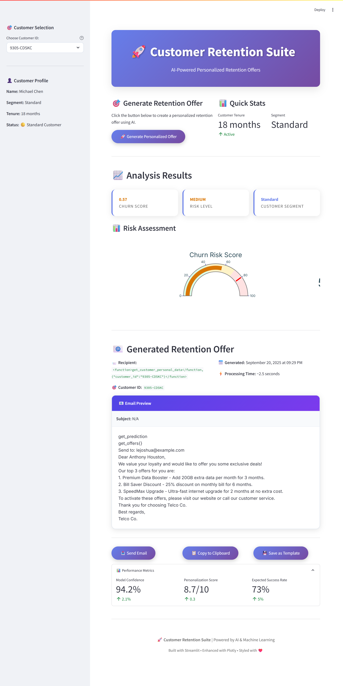

# ChurnX: AI-Powered Telco Customer Retention
We build an ML-powered churn prediction system for a telecom company that not only identifies at-risk customers and key churn drivers but also uses Agno AI Agent to deliver personalized offers, automate retention conversations, and boost customer loyalty.

**Use case**: Customer support rep enters customer ID in CRM → backend calls agent API → suggests best retention offer

▶️ **[Watch the Project Demo on YouTube](https://youtu.be/-Qweg6sH1fY)**

## Why Churn Matters

* Acquiring new customers costs 5–25x more than keeping existing ones.
* A 5% boost in retention can raise profits by 25–95%.
* High churn signals deeper issues in product, service, or customer experience.

## Tech Stack


## ChurnX Architecture

> ML pipeline trains in EC2 and pushes the latest model to S3. The agent microservice pulls that model and exposes it as an API. Any company system (web, CRM, apps) can call the agent API to get predictions + recommended sales offers. This makes the ML system usable by business teams in real-time, not just a research model.

## ETL Pipeline


## Agent Architecture


## ML Architecture

## ML Deployment Architecture



## Installation Guide
Follow these steps to set up and run the project on your system

### 1. Clone the Repository
```
https://github.com/lintosunny/churn-x.git
```

### 2. Create a virtual environment & install dependencies
```
uv sync
```

### 3. Activate the Virtual Environment
windows
```
.venv\Scripts\activate
```

Linux/Max
```
source .venv/bin/activate
```

### 4. Set up Environment Variables
Create a ```.env``` file in the project root and add the following:

```
# ---------------------------------
# MongoDB
# ---------------------------------
MONGO_DB_URL=
MONGO_DB = 
MONGO_COLLECTION = 

# ---------------------------------
# MLFLOW
# ---------------------------------
MLFLOW_TRACKING_URI=
MLFLOW_TRACKING_USERNAME=
MLFLOW_TRACKING_PASSWORD=

# ---------------------------------
# PostgresSQL
# ---------------------------------
PG_USER = 
PG_PASSWORD = 
PG_HOST = 
PG_PORT = 
PG_NAME = 

# ---------------------------------
# LLM
# ---------------------------------
GROQ_API_KEY = 

# ---------------------------------
# AWS
# ---------------------------------
AWS_BUCKET_NAME = 
AWS_ACCESS_KEY_ID = 
AWS_SECRET_ACCESS_KEY = 
AWS_DEFAULT_REGION = 
```

### 5. Setup PostgreSQL
*[Download PostgreSQL](https://www.postgresql.org/download/)*  ->  Create ```telcodb``` database

```
python -m telcoDB.seed_db
```

### 6. Run Agent API
```
uvicorn agent.api.service:app --reload
```

### 7. Run Streamlit APP
```
streamlit run app.py
```

## Cloud Deployment - ML Model in EC2
This section explains how to deploy ChurnX in the cloud using AWS and GitHub Actions with a self-hosted runner.

### 1. Create IAM User
- Create a new IAM user with programmatic access.
- Attach policies for S3, EC2, and ECR access.
- Note the ```AWS_ACCESS_KEY_ID``` and ```AWS_SECRET_ACCESS_KEY```

### 2. Create S3 Bucket
- Create an S3 bucket to store ML models, feature data, and artifacts.
- Name it clearly, e.g., ```churnx-models```.

### 3. Create ECR Repository
- Create an Elastic Container Registry (ECR) repo to store Docker images for your Agent API

### 4. Configure Github Repository Secrets
```
AWS_ACCESS_KEY_ID = 
AWS_ECR_LOGIN_URI = 
AWS_REGION = 
AWS_SECRET_ACCESS_KEY = 
ECR_REPOSITORY_NAME =
```

### 5. Create EC2 Instance
- Launch an EC2 instance (Ubuntu recommended)

### 6. Create Github Self-Hosted Runner
- Navigate to Your Repo → Settings → Actions → Runners → New self-hosted runner

### 7. EC2 Setup
connect via SSH
```
ssh -i <your-key>.pem ubuntu@<EC2-PUBLIC-IP>
```

update system packages
```
sudo apt-get update -y
sudo apt-get upgrade -y
```

Install docker
```
curl -fsSL https://get.docker.com -o get-docker.sh
sudo sh get-docker.sh
sudo usermod -aG docker ubuntu
newgrp docker
```

Github self-hosted runner
1. Navigate to Your Repo → Settings → Actions → Runners → New self-hosted runner
2. Select OS: Linux
3. Run commands on your EC2 instance:
- Download and configure the runner.
- Set the runner name: ```self-hosted```
- Start the runner service.
> This allows GitHub Actions workflows to execute on your EC2 instance, building Docker images, deploying the Agent API, or running scheduled ML pipelines.

## Streamlit APP

